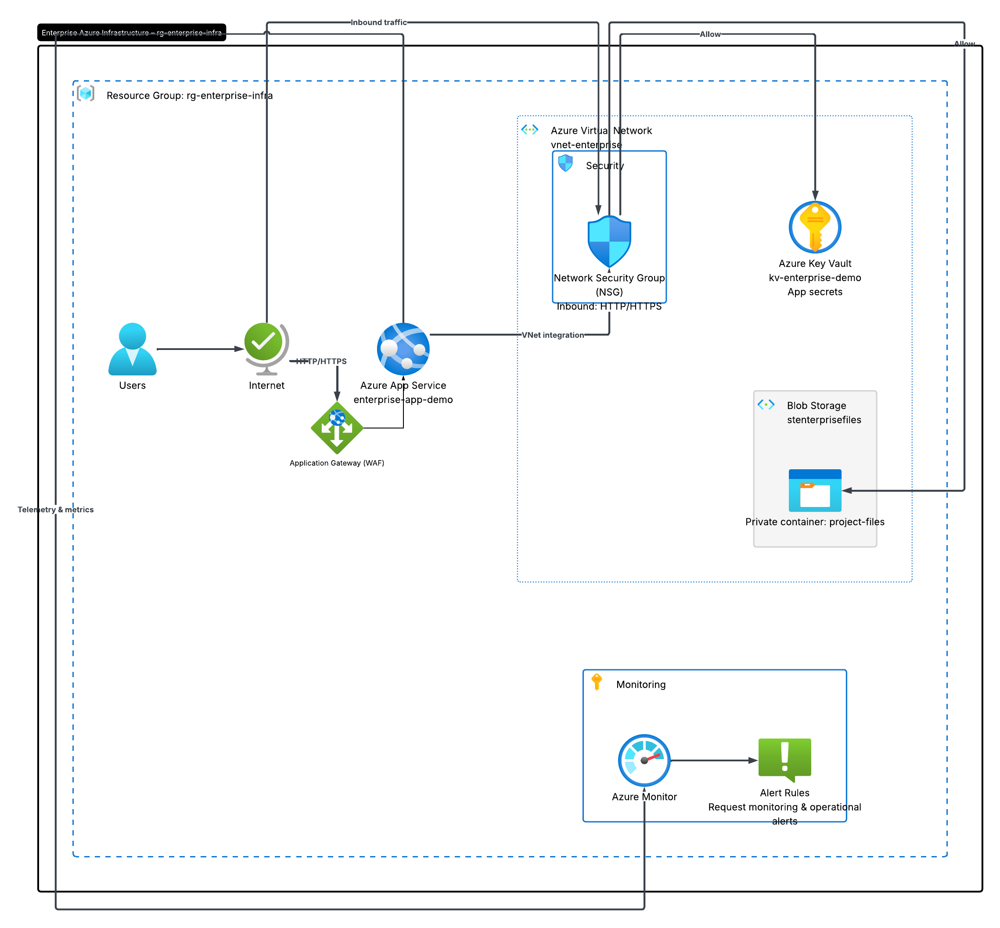

# Azure Enterprise Infrastructure Project

## Overview
This project demonstrates the deployment of a secure enterprise-style cloud infrastructure environment using Microsoft Azure free-tier services. The project includes networking, storage, security, monitoring, alerting, and application hosting components commonly used in real-world cloud engineering environments.

---

# Business Problem
A growing organization needed a secure and scalable cloud environment to host internal business applications, securely store files, manage secrets, and monitor application performance while minimizing infrastructure costs.

---

# Solution
Designed and deployed a cloud infrastructure solution in Microsoft Azure using:
- Azure App Service
- Azure Virtual Network (VNet)
- Network Security Groups (NSGs)
- Azure Blob Storage
- Azure Key Vault
- Azure Monitor
- Azure Alert Rules

---

# Architecture Diagram

---

# Azure Services Used

| Service | Purpose |
|---|---|
| Azure App Service | Hosted cloud web application |
| Azure Virtual Network | Secure internal networking |
| Network Security Group | Controlled inbound HTTP/HTTPS traffic |
| Azure Blob Storage | Stored enterprise project files |
| Azure Key Vault | Managed application secrets securely |
| Azure Monitor | Collected telemetry and monitoring metrics |
| Azure Alerts | Configured operational alerting |
| Resource Groups | Organized cloud infrastructure resources |

---

# Key Features

- Secure cloud-hosted web application
- Enterprise-style networking architecture
- Firewall security configuration
- Blob storage with private containers
- Secret management using Azure Key Vault
- Application monitoring and telemetry
- Alert rule configuration for operational monitoring
- Free-tier cost optimization strategy

---

# Monitoring & Alerting

Configured Azure Monitor to:
- Track live application requests
- Generate telemetry metrics
- Visualize request traffic
- Create operational alert rules

---

# Security Configuration

Implemented:
- Network Security Groups (NSGs)
- HTTPS traffic controls
- Private blob storage containers
- Azure Key Vault secret management
- RBAC/IAM permission management

---

# Screenshots

## Live Web Application

## Azure Monitor Metrics

## Azure Alert Rule

## Azure Key Vault

---

# Skills Demonstrated

- Cloud Infrastructure Deployment
- Azure Networking
- Cloud Security
- Monitoring & Observability
- Identity & Access Management
- Storage Management
- Application Hosting
- Cloud Operations Engineering

---

# Lessons Learned

- Configuring Azure networking and security services
- Managing secrets securely using Azure Key Vault
- Troubleshooting RBAC permission issues
- Monitoring cloud application telemetry
- Deploying secure cloud-hosted applications
- Managing cloud resources within free-tier limits

---

# Future Improvements

- Terraform Infrastructure as Code deployment
- CI/CD automation using GitHub Actions
- Docker container deployment
- Azure Front Door or Application Gateway
- Advanced monitoring dashboards
- Multi-cloud integration with AWS and GCP

---

# Author

Jamie Christian
