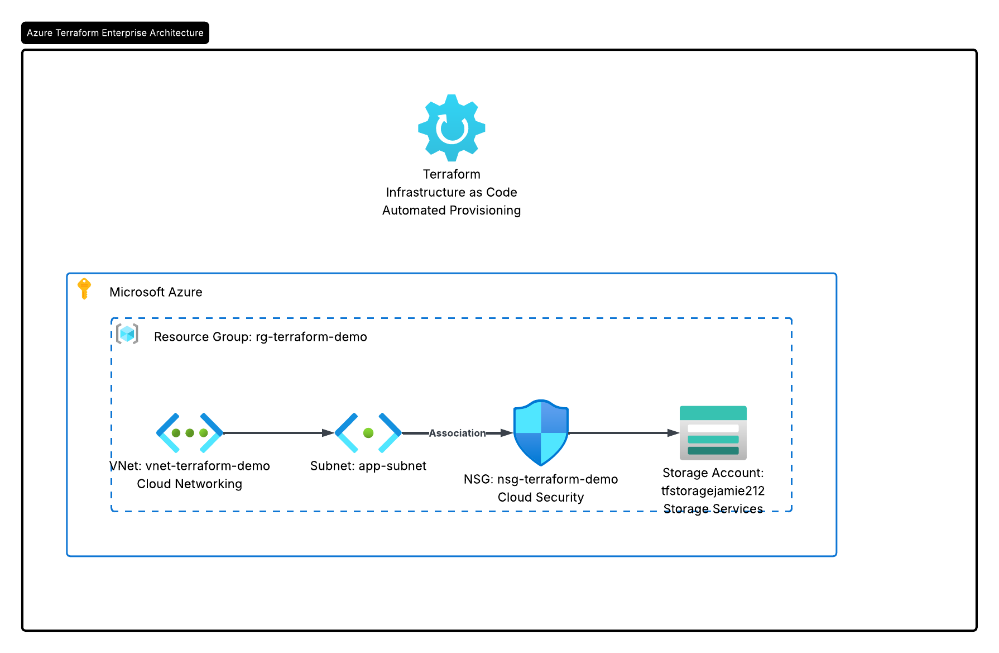
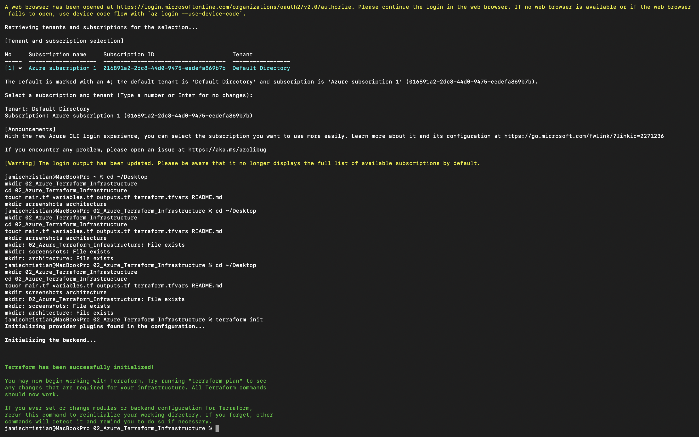
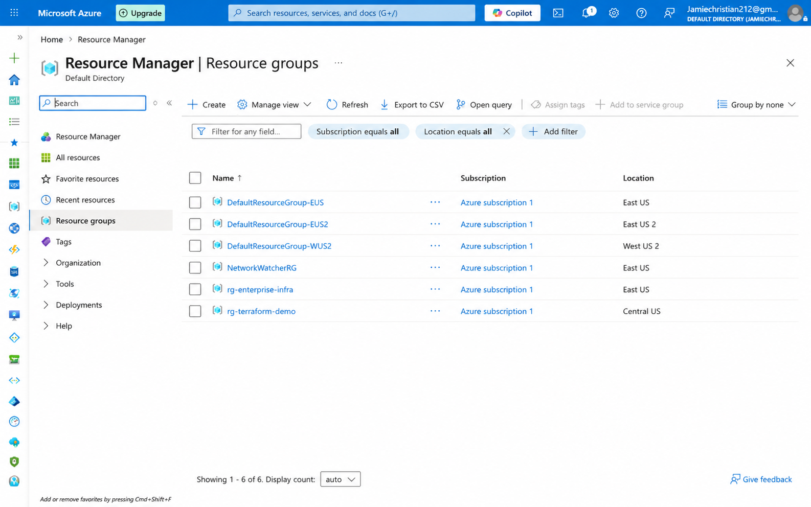
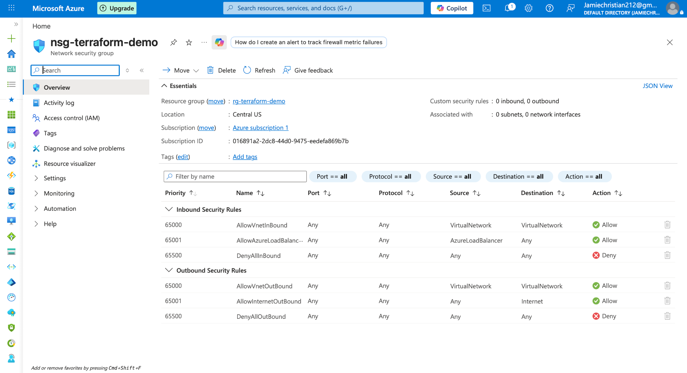
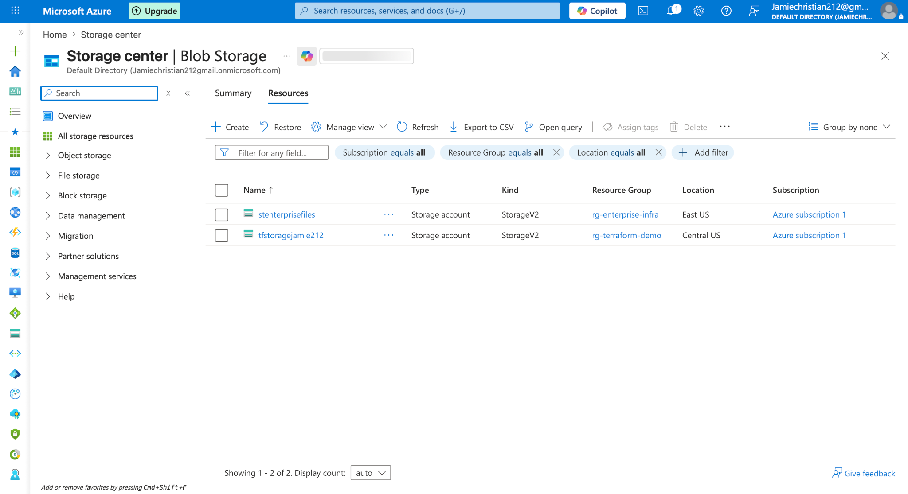

# 🏗️ Azure Terraform Infrastructure


---

# 📌 Project Overview

The Azure Terraform Infrastructure project demonstrates how cloud infrastructure can be provisioned, managed, and documented using Terraform Infrastructure-as-Code. This project focuses on automating Azure infrastructure deployment with reusable configuration files, provider setup, variables, outputs, backend planning, and modular cloud engineering practices.

The goal of this project is to simulate a real-world Infrastructure-as-Code workflow where Azure resources are deployed consistently, securely, and repeatably using Terraform instead of manual portal-only configuration.

---

# 🎯 Business Problem

Organizations need reliable, repeatable, and auditable infrastructure deployments. Manual cloud provisioning can lead to configuration drift, inconsistent environments, security gaps, and deployment errors.

This project solves that problem by using Terraform to define Azure infrastructure as code, enabling repeatable deployment, easier documentation, better version control, and stronger operational consistency.

---

# ☁️ Technologies Used

- Microsoft Azure
- Terraform
- Azure Resource Manager
- Azure Virtual Network
- Network Security Groups
- Azure Storage
- Azure Monitor
- GitHub
- Infrastructure-as-Code

---

# 🏗️ Architecture Overview

This project represents an Azure infrastructure environment provisioned through Terraform. The infrastructure includes cloud networking, security controls, storage resources, and monitoring-ready architecture.

## Core Components

- Azure Resource Group
- Azure Virtual Network
- Network Security Groups
- Azure Storage Account
- Monitoring-ready infrastructure
- Terraform provider configuration
- Terraform variables and outputs

---

# 🖼️ Architecture Diagram



---

# 🛠️ Project Structure

```txt
02_Azure_Terraform_Infrastructure/
│
├── README.md
├── architecture/
│   └── terraform-architecture-diagram.png
├── Screenshots/
│
├── terraform/
│   ├── provider.tf
│   ├── main.tf
│   ├── variables.tf
│   ├── outputs.tf
│   ├── terraform.tfvars
│   └── backend.tf
│
├── modules/
├── documentation/
└── .gitignore
```

---

# 🌐 Infrastructure-as-Code Workflow

Terraform was used to define Azure resources in code rather than manually creating every service through the Azure Portal.

## Terraform Workflow

```bash
terraform init
terraform validate
terraform plan
terraform apply
```

---

# 📂 Terraform Files

## provider.tf
Configures the AzureRM provider and Terraform requirements.

## main.tf
Defines the main Azure infrastructure resources.

## variables.tf
Stores reusable input variables for names, regions, tags, and configuration values.

## outputs.tf
Displays useful deployment outputs such as resource group names and storage account details.

## terraform.tfvars
Stores environment-specific variable values.

## backend.tf
Represents backend configuration planning for remote Terraform state management.

---

# 🔐 Security Considerations

This project includes cloud security concepts such as:
- Infrastructure-as-Code version control
- resource tagging
- Network Security Group planning
- secure variable handling
- reduced manual configuration drift
- repeatable infrastructure deployment

## Future Security Enhancements
- remote state locking
- Azure Key Vault integration
- RBAC policies
- policy-as-code
- automated security scanning

---

# 📊 Monitoring & Observability

This project was designed to support future monitoring and observability through:
- Azure Monitor
- Log Analytics
- infrastructure health tracking
- resource-level metrics
- operational dashboards

---

# 💰 Cost Optimization

Cost-conscious decisions include:
- reusable Terraform configuration
- minimal resource deployment
- modular infrastructure structure
- controlled cloud scaling

## Future Improvements
- budgets & alerts
- autoscaling
- lifecycle management
- infrastructure cleanup automation

---

# 📋 Deployment Instructions

## 1. Navigate to Terraform Directory

```bash
cd terraform
```

## 2. Initialize Terraform

```bash
terraform init
```

## 3. Validate Configuration

```bash
terraform validate
```

## 4. Preview Infrastructure

```bash
terraform plan
```

## 5. Apply Infrastructure

```bash
terraform apply
```

## 6. Destroy Infrastructure

```bash
terraform destroy
```

---

# 📸 Screenshots

## Terraform Init Success



---

## Terraform Validate Success


---

## Azure Resource Group Created



---

## Network Security Group Created



---

## Storage Account Created



---

## Terraform Architecture Diagram


---

# 📚 Documentation

Additional documentation is included in the `documentation/` folder.

```txt
documentation/
├── deployment-guide.md
├── security-considerations.md
└── cost-optimization.md
```

---

# 📚 Resume-Relevant Skills Demonstrated

- Terraform
- Microsoft Azure
- Infrastructure-as-Code
- Azure Networking
- Azure Storage
- Network Security Groups
- Cloud Infrastructure
- DevOps Concepts
- Automation
- Infrastructure Provisioning
- Cloud Architecture

---

# 🧠 Lessons Learned

This project strengthened understanding of:
- Terraform Infrastructure-as-Code workflows
- Azure provider configuration
- repeatable infrastructure deployment
- cloud automation
- infrastructure lifecycle management
- infrastructure documentation
- cloud architecture planning

---

# 🚀 Future Improvements

Potential future enhancements include:
- Terraform modules
- GitHub Actions CI/CD
- remote Terraform backends
- Azure Key Vault integration
- infrastructure testing
- multi-environment deployments
- policy automation

---

# 🎯 Career Relevance

This project supports skills relevant to:
- Cloud Engineer
- Infrastructure Engineer
- DevOps Engineer
- Platform Engineer
- Cloud Operations Engineer

---

# ✅ Project Status

Completed Azure Terraform Infrastructure project demonstrating Infrastructure-as-Code, Azure provisioning, cloud automation, networking, security controls, and DevOps-oriented infrastructure workflows.
