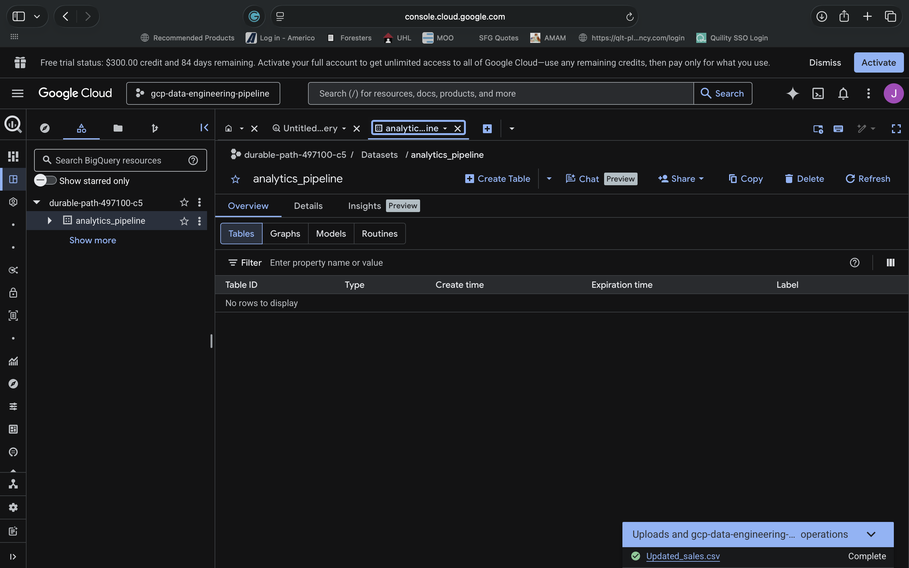
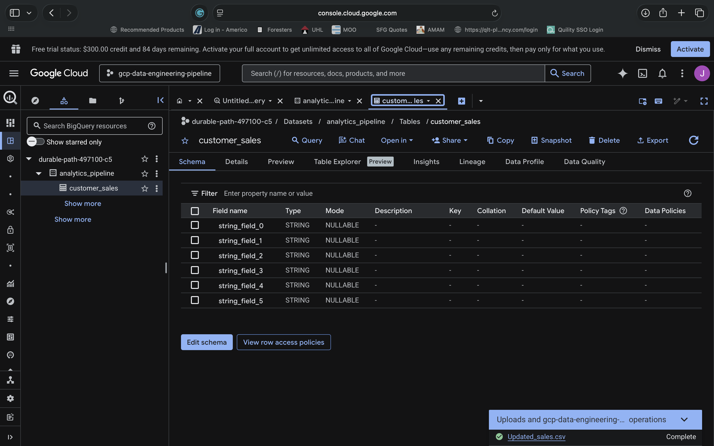

# 📊 GCP Data Engineering Pipeline


---

# 📌 Project Overview

The GCP Data Engineering Pipeline project demonstrates a cloud-native analytics engineering workflow using Google Cloud Platform services including BigQuery, SQL analytics, cloud storage concepts, and operational monitoring.

This project simulates a real-world enterprise analytics environment where cloud-based datasets are ingested, queried, transformed, and visualized using scalable Google Cloud infrastructure.

The project focuses on:
- analytics engineering
- BigQuery workflows
- SQL analytics
- cloud-native data pipelines
- operational monitoring
- scalable cloud data architecture

---

# ☁️ Technologies Used

- Google Cloud Platform (GCP)
- BigQuery
- SQL
- Cloud Storage
- Python
- Terraform
- Cloud Monitoring
- Analytics Engineering

---

# 🏗️ Architecture Overview

This project simulates a cloud analytics pipeline consisting of:
- cloud-based datasets
- BigQuery tables
- SQL analytics workflows
- monitoring & observability
- analytics dashboards
- cloud-native reporting architecture

---

# 🖼️ Architecture Diagram


---

# 🛠️ Project Structure

```txt
03_GCP_Data_Engineering_Pipeline/
│
├── README.md
├── architecture/
├── screenshots/
├── sql/
├── scripts/
├── datasets/
├── documentation/
└── .gitignore
```

---

# 📂 BigQuery Dataset

BigQuery was used as the central cloud analytics warehouse.

## BigQuery Features
- scalable analytics
- SQL querying
- cloud-native data warehousing
- high-performance analytics

## Dataset Goals
- enterprise reporting
- analytics engineering
- KPI analysis
- operational insights

---

# 📊 SQL Analytics

SQL queries were used to analyze cloud-based datasets and generate reporting insights.

## SQL Features
- aggregation queries
- KPI calculations
- filtering & grouping
- analytics reporting

## Example Query

```sql
SELECT
  product_name,
  SUM(revenue) AS total_revenue
FROM insurance_analytics.sales
GROUP BY product_name
ORDER BY total_revenue DESC;
```

---

# 🔄 Data Pipeline Workflow

The analytics pipeline workflow includes:
1. dataset ingestion
2. BigQuery storage
3. SQL querying
4. analytics reporting
5. monitoring & observability

---

# 📊 Monitoring & Observability

Monitoring concepts include:
- BigQuery monitoring
- query tracking
- dataset visibility
- analytics observability
- cloud operational monitoring

---

# 🔐 Security Considerations

This project demonstrates cloud data security concepts.

## Security Features
- cloud dataset access control
- analytics isolation
- monitoring visibility
- Infrastructure-as-Code planning

## Future Improvements
- IAM hardening
- dataset-level permissions
- encrypted storage
- data governance policies

---

# 🏗️ Terraform Infrastructure-as-Code

Terraform planning concepts were included to support Infrastructure-as-Code workflows for cloud analytics environments.

## Terraform Features
- cloud resource automation
- repeatable infrastructure deployment
- scalable analytics provisioning
- cloud-native IaC workflows

---

# 📋 Deployment Workflow

## Initialize Terraform

```bash
terraform init
```

## Validate Terraform

```bash
terraform validate
```

## Deploy Infrastructure

```bash
terraform apply
```

---

# 📸 Screenshots

## GCP Console Dashboard


---

## Dataset Upload


---

## BigQuery Workspace


---

## BigQuery Dataset



---

## BigQuery Table



---

## SQL Query Results


---

## Monitoring Dashboard


---

## Architecture Diagram


---

# 📚 Resume-Relevant Skills Demonstrated

- Google Cloud Platform
- BigQuery
- SQL
- Analytics Engineering
- Cloud Data Pipelines
- Terraform
- Cloud Monitoring
- Data Warehousing
- KPI Reporting
- Cloud-Native Analytics
- Infrastructure-as-Code

---

# 🧠 Lessons Learned

This project strengthened understanding of:
- BigQuery analytics
- SQL reporting workflows
- cloud-native data pipelines
- analytics engineering
- monitoring & observability
- Infrastructure-as-Code concepts
- cloud analytics architecture

---

# 🚀 Future Improvements

Potential future enhancements:
- streaming data pipelines
- Airflow orchestration
- Looker Studio dashboards
- automated ETL workflows
- advanced monitoring
- machine learning integration
- cloud-native data governance

---

# 🎯 Career Relevance

This project supports skills relevant to:
- Cloud/Data Engineer
- Data Engineer
- Analytics Engineer
- Cloud Engineer
- BI Engineer

---

# ✅ Project Status

Completed GCP Data Engineering Pipeline project demonstrating BigQuery analytics, SQL reporting, monitoring, cloud-native data engineering workflows, and Infrastructure-as-Code planning.
