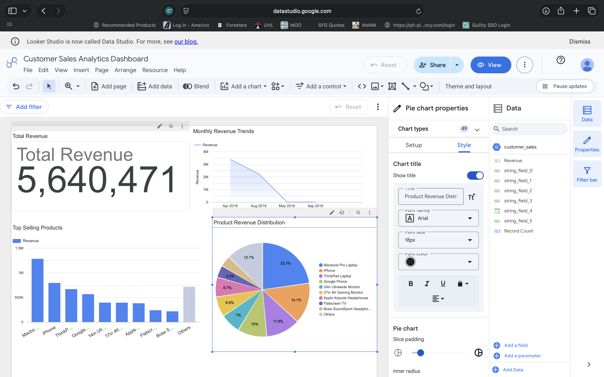
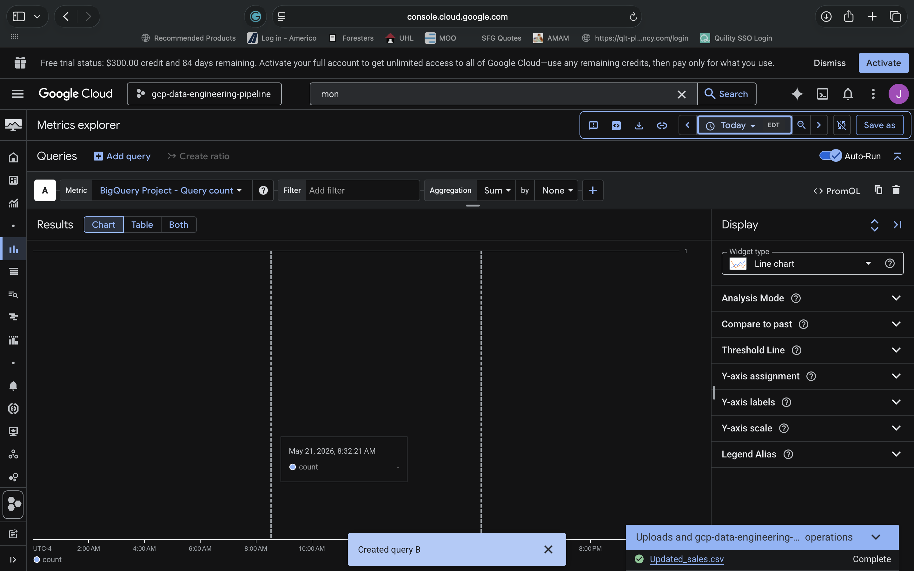

# ☁️ GCP BigQuery Data Engineering Pipeline

## 📌 Project Overview

This project demonstrates a real-world cloud data engineering analytics pipeline built on Google Cloud Platform (GCP). The solution ingests customer sales data into BigQuery, performs SQL-based transformations and analytics, visualizes business KPIs in Looker Studio, and monitors cloud metrics using Google Cloud Monitoring.

The project was designed using GCP free-tier services and simulates a production-style analytics workflow commonly used by cloud engineers, data engineers, and BI analysts.

---

# 🚀 Architecture

CSV Dataset → BigQuery → SQL Transformations → Looker Studio Dashboard → Cloud Monitoring

---

# 🛠️ Technologies Used

## Cloud & Data Platforms
- Google Cloud Platform (GCP)
- BigQuery
- Cloud Monitoring
- Looker Studio

## Languages & Tools
- SQL
- Python
- GitHub
- CSV Data Processing

## Monitoring & Visualization
- Metrics Explorer
- KPI Dashboards
- Revenue Analytics
- Product Sales Reporting

---

# 📂 Project Structure

```bash
03_GCP_Data_Engineering_Pipeline/
│
├── screenshots/
│   ├── 01-bigquery-dataset.png
│   ├── 02-table-upload.png
│   ├── 03-bigquery-table.png
│   ├── 04-sql-queries.png
│   ├── 05-query-results.png
│   ├── 06-looker-dashboard.png
│   ├── 07-dashboard.png
│   └── 08-monitoring.png
│
├── sql/
│   ├── analytics_queries.sql
│   ├── transformations.sql
│   └── create_tables.sql
│
├── scripts/
│   └── upload_data.py
│
├── documentation/
│   ├── deployment-guide.md
│   ├── security-considerations.md
│   └── cost-optimization.md
│
└── README.md
```

---

# 📊 Key Features

## ✅ BigQuery Data Warehouse
- Created cloud-hosted analytics dataset
- Uploaded structured CSV sales data
- Built analytical SQL workflows

## ✅ SQL Analytics
- Revenue calculations
- Product performance analysis
- Monthly sales trend reporting
- Data transformations using SQL

## ✅ Looker Studio Dashboard
Created interactive business intelligence dashboards including:
- Total Revenue KPI
- Monthly Revenue Trends
- Top Selling Products
- Product Revenue Distribution

## ✅ Cloud Monitoring & Observability
Configured:
- BigQuery Query Metrics
- Metrics Explorer
- Monitoring dashboards
- Operational observability workflows

---

# 📈 Dashboard Preview

## Customer Sales Analytics Dashboard

### KPI Metrics
- Total Revenue
- Product Revenue
- Monthly Revenue Trends

### Visualizations
- Line Charts
- Bar Charts
- Pie Charts
- KPI Cards

---

# 📸 Project Screenshots

## BigQuery Dataset Setup


## SQL Query Execution


## Query Results


## Final Dashboard


## Monitoring & Observability


---

# 🔍 Sample SQL Analytics

## Total Revenue Query

```sql
SELECT 
    SUM(
        SAFE_CAST(string_field_2 AS NUMERIC) *
        SAFE_CAST(string_field_3 AS NUMERIC)
    ) AS total_revenue
FROM `durable-path-497100-c5.analytics_pipeline.customer_sales`;
```

---

# ⚙️ Deployment Process

## Step 1 — Create GCP Project
- Enable BigQuery API
- Enable Monitoring API

## Step 2 — Create Dataset
Dataset:
```bash
analytics_pipeline
```

## Step 3 — Upload CSV Data
Uploaded:
```bash
Updated_sales.csv
```

## Step 4 — Execute SQL Scripts
Run:
- create_tables.sql
- transformations.sql
- analytics_queries.sql

## Step 5 — Build Dashboard
Use Looker Studio to create:
- KPI cards
- Revenue charts
- Product analytics dashboards

## Step 6 — Configure Monitoring
Track:
- Query count
- Storage metrics
- BigQuery usage

---

# 🔐 Security Considerations

This project follows foundational cloud security practices including:
- IAM role-based access
- Least privilege access control
- Monitoring and logging
- API restriction best practices

---

# 💰 Cost Optimization

Designed for free-tier usage by:
- Using lightweight datasets
- Limiting query sizes
- Optimizing dashboard refreshes
- Monitoring query usage

---

# 🎯 Business Value

This project demonstrates practical skills in:
- Cloud Data Engineering
- SQL Analytics
- Business Intelligence
- Cloud Monitoring
- Data Visualization
- Cloud Operations

---

# 📚 Skills Demonstrated

## Data Engineering
- ETL workflows
- SQL transformations
- BigQuery analytics

## Cloud Engineering
- GCP resource management
- Monitoring & observability
- Cloud-native analytics

## Business Intelligence
- KPI reporting
- Dashboard development
- Revenue analytics

---

# 👨‍💻 Author

## Jamie Christian

### Certifications
- Google Advanced Data Analytics
- Google Cloud Certifications
- IBM Data Engineering
- Microsoft Power BI Data Analyst
- Tableau Business Intelligence Analyst

### GitHub Portfolio
:contentReference[oaicite:2]{index=2}

---

# ⭐ Project Status

✅ Completed  
✅ Portfolio Ready  
✅ Cloud Monitoring Enabled  
✅ Dashboard Operational  
✅ BigQuery Analytics Functional
