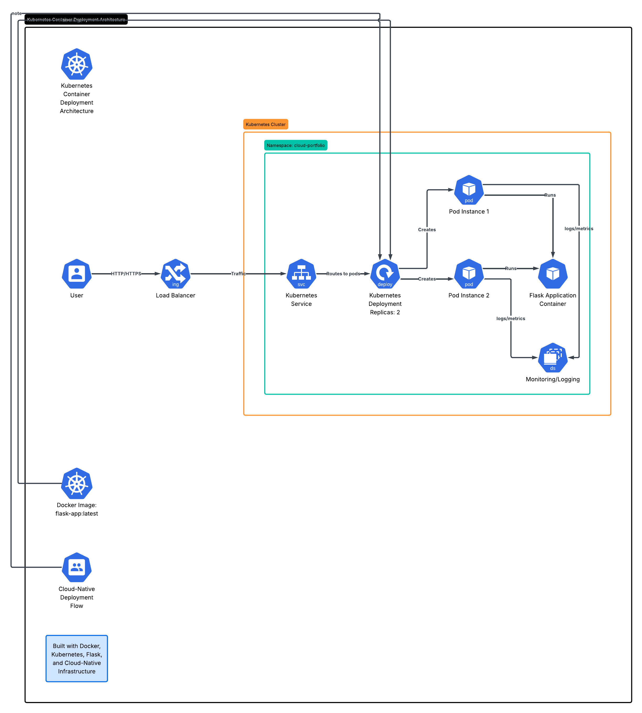

# 🚀 Kubernetes Container Deployment


---

# 📌 Project Overview

This project demonstrates a complete cloud-native Kubernetes deployment workflow using Docker, Kubernetes, Flask, and Infrastructure-as-Code concepts. The application simulates a lightweight insurance platform deployed within a Kubernetes cluster using namespaces, deployments, services, and container orchestration principles.

The project was designed to showcase hands-on experience with:
- containerization
- Kubernetes orchestration
- cloud-native application deployment
- pod management
- load balancing
- monitoring & logging
- Infrastructure-as-Code workflows

---

# ☁️ Technologies Used

- Docker
- Kubernetes
- Flask
- Python
- YAML
- Terraform
- kubectl

---

# 🏗️ Architecture Overview

This project demonstrates a Kubernetes-based cloud-native architecture consisting of:
- Docker containerized application
- Kubernetes deployments
- Kubernetes services
- namespaces
- load balancing
- monitoring & logging
- scalable pod orchestration

---

# 🖼️ Architecture Diagram



---

# 🛠️ Project Structure

```txt
05_Kubernetes_Container_Deployment/
│
├── README.md
├── app/
├── docker/
├── kubernetes/
├── architecture/
│   └── architecture-diagram-4.png
├── screenshots/
├── documentation/
├── terraform/
└── .gitignore
```

---

# 📦 Containerized Application

The Flask application simulates a cloud-native insurance platform.

## Application Features
- Flask web application
- Docker container deployment
- Kubernetes orchestration
- scalable architecture
- cloud-native workflow

---

# 🐳 Docker Containerization

Docker was used to package the application into a portable runtime environment.

## Docker Features
- lightweight Python image
- containerized Flask application
- exposed application port
- consistent runtime environment

## Build Docker Image

```bash
docker build -t cloud-insurance-app:1.0 -f docker/Dockerfile .
```

## Run Container Locally

```bash
docker run -p 8080:8080 cloud-insurance-app:1.0
```

---

# ☸️ Kubernetes Deployment

Kubernetes orchestrates the containerized application using deployments and services.

## Kubernetes Components
- Namespace
- Deployment
- Service
- Pods
- Load Balancer

## Deployment Features
- 2 pod replicas
- rolling deployment workflow
- self-healing containers
- scalable architecture

---

# 🌐 Kubernetes Namespace

The project uses an isolated namespace:

```txt
cloud-portfolio
```

Namespaces help organize and isolate workloads within Kubernetes clusters.

---

# 🔄 Kubernetes Services

The application is exposed using a Kubernetes LoadBalancer Service.

## Service Features
- external application access
- traffic routing
- load balancing
- scalable connectivity

---

# 📋 Kubernetes Commands

## Deploy Kubernetes Resources

```bash
kubectl apply -f kubernetes/namespace.yaml
kubectl apply -f kubernetes/deployment.yaml
kubectl apply -f kubernetes/service.yaml
```

## View Pods

```bash
kubectl get pods -n cloud-portfolio
```

## View Services

```bash
kubectl get svc -n cloud-portfolio
```

## View Logs

```bash
kubectl logs -n cloud-portfolio -l app=cloud-insurance-app
```

---

# 📊 Monitoring & Logging

Monitoring and observability were performed using Kubernetes operational tools.

## Monitoring Features
- pod health monitoring
- deployment visibility
- service monitoring
- centralized logs
- operational troubleshooting

## Monitoring Commands

```bash
kubectl describe pods -n cloud-portfolio
```

```bash
kubectl logs -n cloud-portfolio -l app=cloud-insurance-app
```

---

# 🔐 Security Considerations

This project demonstrates foundational cloud-native security concepts.

## Security Features
- namespace isolation
- workload separation
- Infrastructure-as-Code deployment
- containerized environments
- operational monitoring

## Future Security Improvements
- RBAC policies
- Kubernetes Secrets
- TLS encryption
- Network Policies
- vulnerability scanning

---

# 🏗️ Terraform Infrastructure-as-Code

Terraform planning files are included to support Infrastructure-as-Code workflows.

## Terraform Features
- Kubernetes infrastructure planning
- repeatable deployments
- infrastructure automation
- cloud-native provisioning

---

# 📸 Screenshots

## Docker Build Success


---

## Local Container Running


---

## Kubernetes Pods Running


---

## Kubernetes Service Created


---

## Load Balancer Application


---

## Kubernetes Logs


---

## Pod Details


---

## Architecture Diagram


---

# 📚 Resume-Relevant Skills Demonstrated

- Kubernetes
- Docker
- Terraform
- Flask
- Python
- YAML
- Infrastructure-as-Code
- Container Orchestration
- Cloud-Native Architecture
- Monitoring & Logging
- Load Balancing
- DevOps Concepts

---

# 🧠 Lessons Learned

This project strengthened understanding of:
- Docker containerization
- Kubernetes orchestration
- deployment workflows
- load balancing
- monitoring & logging
- cloud-native application architecture
- Infrastructure-as-Code concepts
- Kubernetes troubleshooting

---

# 🚀 Future Improvements

Potential future enhancements:
- Helm charts
- Kubernetes ingress controllers
- autoscaling
- CI/CD pipelines
- GitHub Actions
- Prometheus & Grafana monitoring
- cloud-managed Kubernetes clusters
- service mesh architecture

---

# 🎯 Career Relevance

This project supports skills relevant to:
- Cloud Engineer
- DevOps Engineer
- Platform Engineer
- Infrastructure Engineer
- Cloud Operations Engineer

---

# ✅ Project Status

Completed Kubernetes container deployment project demonstrating Docker containerization, Kubernetes orchestration, monitoring, load balancing, Infrastructure-as-Code planning, and cloud-native engineering workflows.
