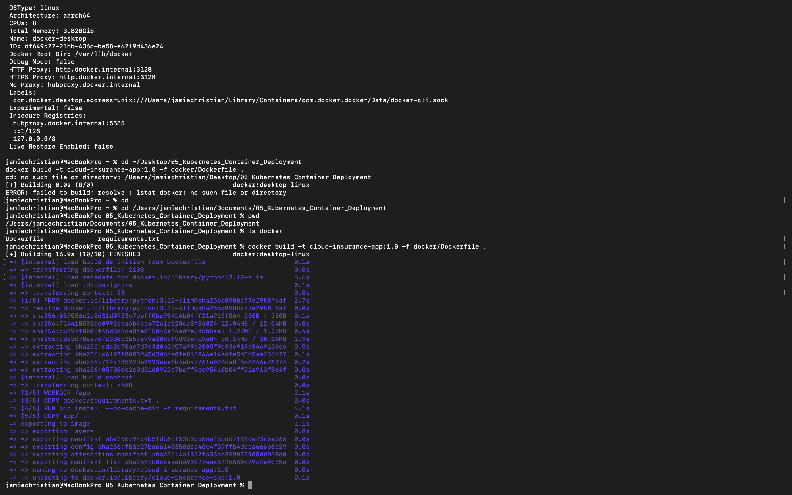
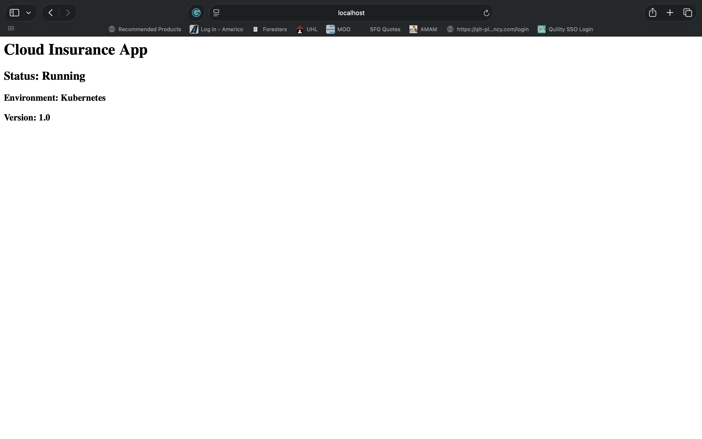
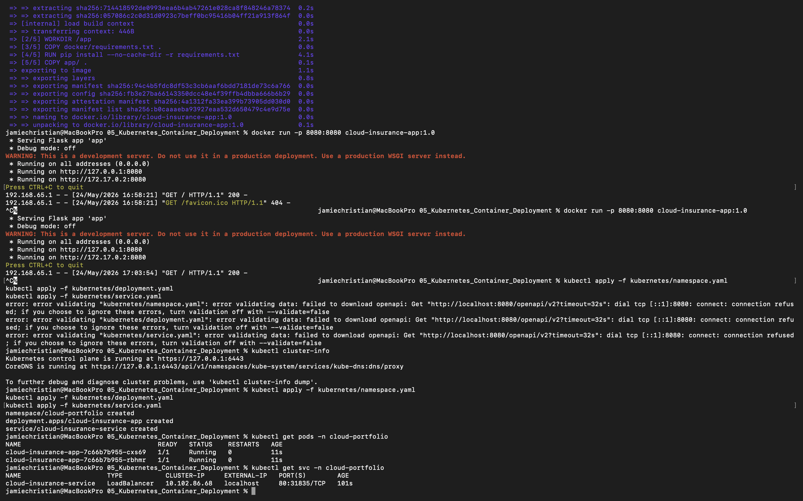
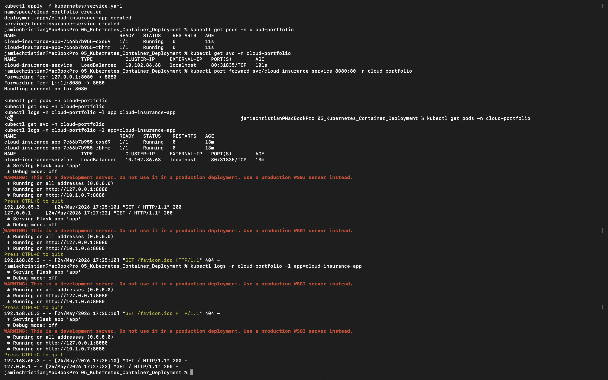
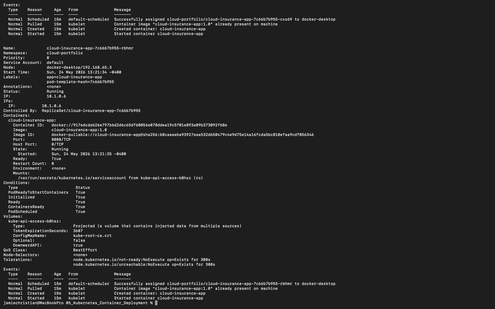

# 🚀 Kubernetes Container Deployment

## 📌 Project Overview

This project demonstrates a complete cloud-native Kubernetes deployment workflow using Docker, Kubernetes, Flask, and Infrastructure-as-Code concepts. The application simulates a lightweight insurance platform deployed within a Kubernetes cluster using namespaces, deployments, services, and container orchestration principles.

The project was designed to showcase hands-on experience with:
- Containerization
- Kubernetes orchestration
- Cloud-native application deployment
- Pod management
- Load balancing
- Monitoring & logging
- Infrastructure automation

---

# 🏗️ Architecture Diagram


---

# ☁️ Technologies Used

- Docker
- Kubernetes
- Flask
- Python
- YAML
- Terraform
- kubectl

---

# 🛠️ Project Structure

```txt
05_Kubernetes_Container_Deployment/
│
├── README.md
├── app/
├── docker/
├── kubernetes/
├── architecture/
├── screenshots/
├── documentation/
├── terraform/
└── .gitignore
```

---

# 📦 Containerized Application

The Flask application displays:
- Cloud Insurance App
- Kubernetes deployment status
- Running environment
- Version information

The application was containerized using Docker and deployed into Kubernetes using deployment and service manifests.

---

# 🐳 Docker Containerization

## Docker Features

- Lightweight Python 3.12 slim image
- Flask-based application container
- Exposed application port 8080
- Portable runtime environment

## Build Docker Image

```bash
docker build -t cloud-insurance-app:1.0 -f docker/Dockerfile .
```

## Run Container Locally

```bash
docker run -p 8080:8080 cloud-insurance-app:1.0
```

---

# ☸️ Kubernetes Deployment

## Namespace

The project uses an isolated Kubernetes namespace:

```txt
cloud-portfolio
```

## Deployment

The deployment configuration includes:
- 2 application replicas
- rolling deployment management
- pod orchestration
- self-healing containers

## Service

The application is exposed using:
- Kubernetes LoadBalancer Service
- Port 80 → Container Port 8080

---

# 📋 Kubernetes Commands

## Deploy Resources

```bash
kubectl apply -f kubernetes/namespace.yaml
kubectl apply -f kubernetes/deployment.yaml
kubectl apply -f kubernetes/service.yaml
```

## View Pods

```bash
kubectl get pods -n cloud-portfolio
```

## View Services

```bash
kubectl get svc -n cloud-portfolio
```

## View Logs

```bash
kubectl logs -n cloud-portfolio -l app=cloud-insurance-app
```

---

# 📊 Monitoring & Logging

Kubernetes monitoring and logging were performed using:
- kubectl logs
- kubectl describe pods
- pod health monitoring
- service verification

The project demonstrates operational visibility into:
- running pods
- deployment health
- container logs
- Kubernetes service exposure

---

# 🔐 Security Considerations

This project implements several cloud-native security concepts:

- Namespace isolation
- Lightweight container images
- Kubernetes resource separation
- Infrastructure-as-Code principles
- Local Kubernetes cluster deployment

Future improvements include:
- RBAC policies
- Kubernetes Secrets
- Network Policies
- TLS encryption
- Container vulnerability scanning

---

# 💰 Cost Optimization

The project was optimized for low-cost local development by using:
- Docker Desktop Kubernetes
- lightweight containers
- local cluster deployment
- efficient replica configuration

Additional optimization opportunities:
- autoscaling
- CPU/memory limits
- centralized monitoring
- cloud-managed Kubernetes services

---

# 📸 Screenshots

## Docker Build



---

## Local Container Running



---

## Kubernetes Pods


---

## Kubernetes Services



---

## Load Balancer Application


---

## Kubernetes Logs



---

## Pod Details



---

# 📚 Key Kubernetes Concepts Demonstrated

- Containerization
- Namespaces
- Deployments
- Services
- Load Balancers
- Pod orchestration
- Replica management
- Cloud-native deployments
- Monitoring & logging

---

# 🧠 Lessons Learned

This project strengthened hands-on understanding of:
- Docker image creation
- Kubernetes YAML configuration
- pod deployment workflows
- service exposure
- container orchestration
- Kubernetes troubleshooting
- monitoring & logging practices

---

# 🚀 Future Improvements

Future enhancements may include:
- Helm charts
- Kubernetes ingress controllers
- Horizontal Pod Autoscaling
- CI/CD pipelines
- GitHub Actions automation
- cloud-managed Kubernetes clusters (GKE/EKS/AKS)
- Prometheus & Grafana monitoring
- Terraform automation for full infrastructure deployment

---

# 🎯 Resume-Relevant Skills Demonstrated

- Docker
- Kubernetes
- Flask
- Python
- YAML
- Terraform
- Cloud-Native Infrastructure
- DevOps Concepts
- Container Orchestration
- Monitoring & Logging
- Infrastructure-as-Code

---

# ✅ Project Status

Completed and successfully deployed within a Kubernetes cluster using Docker Desktop Kubernetes.
