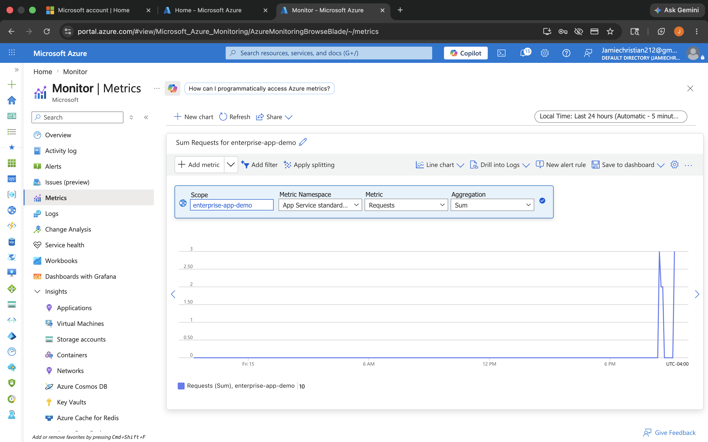
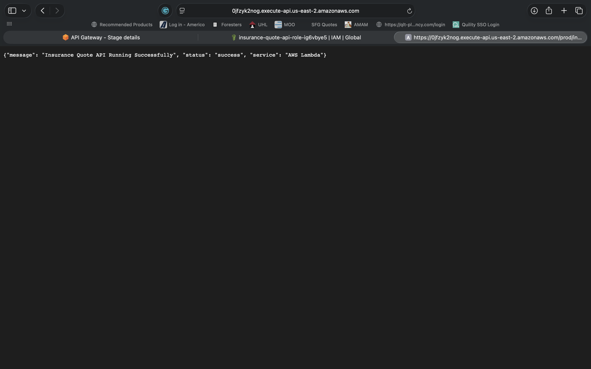
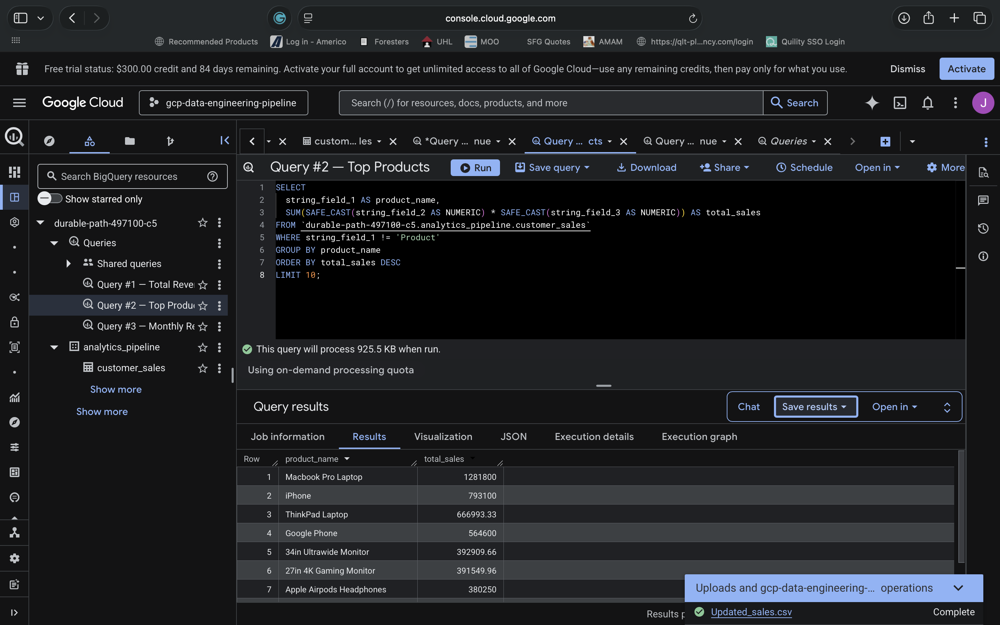
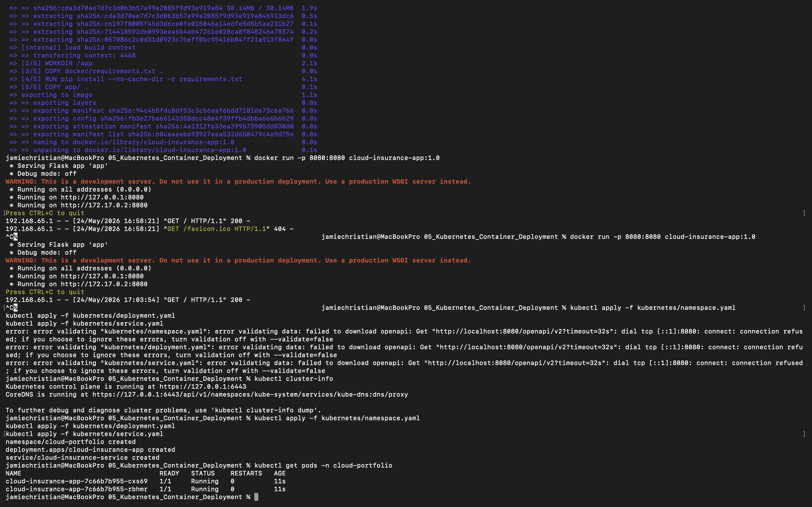
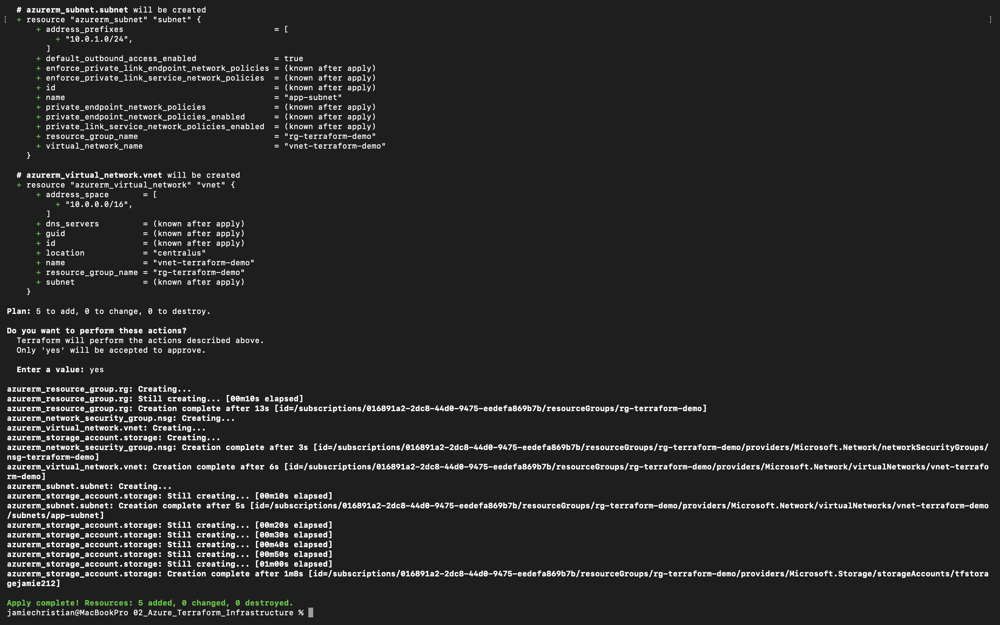
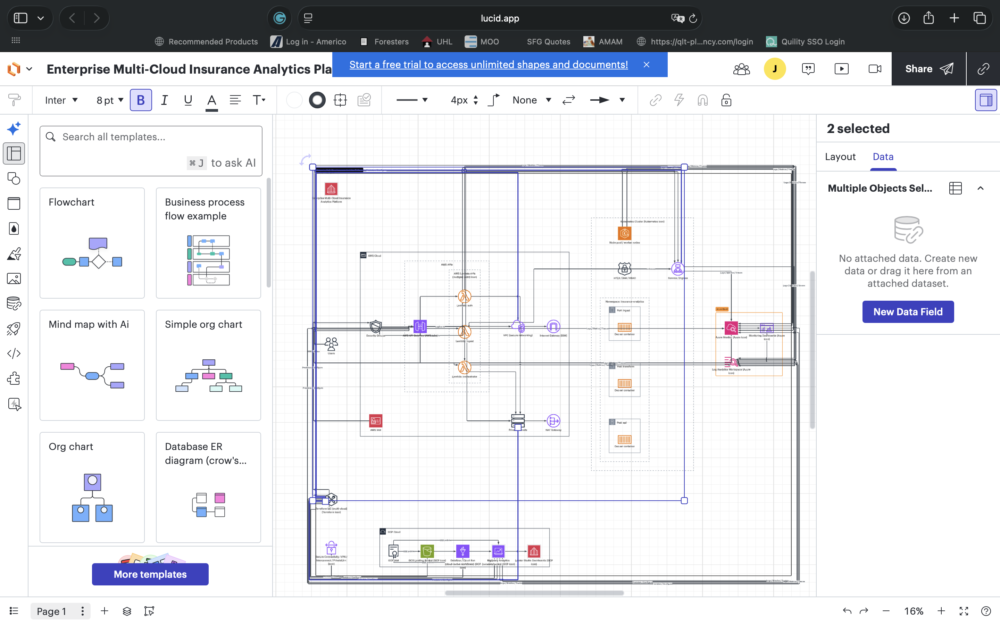

# 🌐 Enterprise Multi-Cloud Insurance Analytics Platform

## 📌 Project Overview

The Enterprise Multi-Cloud Insurance Analytics Platform is a cloud-native engineering capstone project designed to demonstrate real-world enterprise architecture across AWS, Azure, Google Cloud Platform, Kubernetes, Docker, and Terraform.

This project simulates a scalable insurance analytics ecosystem that integrates:
- serverless APIs
- Kubernetes microservices
- cloud analytics pipelines
- centralized monitoring
- Infrastructure-as-Code automation

The platform demonstrates how organizations can combine multiple cloud providers to improve scalability, resiliency, monitoring, analytics, and operational flexibility.

---

# ☁️ Cloud Platforms Used

| Cloud Platform | Purpose |
|---|---|
| AWS | Serverless APIs & Cloud-Native Services |
| Azure | Monitoring, Security & Observability |
| GCP | Analytics & Data Warehousing |
| Kubernetes | Container Orchestration |
| Terraform | Infrastructure Automation |

---

# 🚀 Technologies Used

- AWS Lambda
- API Gateway
- CloudWatch
- Microsoft Azure Monitor
- Azure Log Analytics
- Google BigQuery
- Looker Studio
- Docker
- Kubernetes
- Terraform
- Python
- SQL
- YAML

---

# 🏗️ Multi-Cloud Architecture

## Enterprise Architecture Flow

```txt
Users
 ↓
AWS API Gateway
 ↓
AWS Lambda APIs
 ↓
Kubernetes Microservices
 ↓
GCP BigQuery Analytics
 ↓
Looker Studio Dashboards

Azure Monitor + CloudWatch
monitor all environments

Terraform provisions infrastructure
across AWS, Azure, GCP, and Kubernetes
```

---

# 🖼️ Architecture Diagram


---

# 🛠️ Project Structure

```txt
06_Multi_Cloud_Final_Capstone/
│
├── README.md
│
├── architecture/
│
├── screenshots/
│
├── terraform/
│   ├── aws/
│   ├── azure/
│   ├── gcp/
│   └── kubernetes/
│
├── kubernetes/
│
├── aws/
│   ├── lambda/
│   ├── api-gateway/
│   └── cloudwatch/
│
├── gcp/
│   ├── bigquery/
│   ├── sql/
│   └── dashboards/
│
├── azure/
│   ├── monitoring/
│   ├── networking/
│   └── security/
│
├── documentation/
│
└── .gitignore
```

---

# ⚡ AWS Serverless APIs

AWS services provide scalable serverless API functionality.

## AWS Components
- API Gateway
- AWS Lambda
- CloudWatch Logging

## Features
- insurance quote APIs
- serverless request handling
- scalable cloud-native APIs
- operational monitoring

## Example API Response

```json
{
  "message": "Enterprise Insurance API operational"
}
```

---

# ☸️ Kubernetes Microservices

Kubernetes orchestrates containerized insurance services.

## Kubernetes Features
- container orchestration
- scalable deployments
- replica management
- self-healing workloads
- load balancing

## Kubernetes Components
- Deployment
- Service
- Ingress
- Namespaces

## Example Commands

### Deploy Resources

```bash
kubectl apply -f kubernetes/deployment.yaml
kubectl apply -f kubernetes/service.yaml
kubectl apply -f kubernetes/ingress.yaml
```

### View Pods

```bash
kubectl get pods
```

### View Services

```bash
kubectl get svc
```

---

# 📊 GCP Analytics Pipeline

Google Cloud Platform powers enterprise analytics and reporting.

## GCP Components
- BigQuery
- SQL Analytics
- Looker Studio Dashboards

## Analytics Features
- insurance revenue analytics
- KPI reporting
- SQL-based analytics
- cloud-native dashboards

## Example SQL Query

```sql
SELECT
  product_name,
  SUM(revenue) AS total_revenue
FROM insurance_analytics.sales
GROUP BY product_name
ORDER BY total_revenue DESC;
```

---

# 📈 Dashboard Analytics

The analytics dashboard visualizes:
- revenue KPIs
- customer metrics
- insurance product performance
- operational trends
- cloud monitoring data

Dashboard tools may include:
- Looker Studio
- Tableau
- Power BI

---

# 🔍 Azure Monitoring & Observability

Azure services provide centralized monitoring across the multi-cloud platform.

## Azure Components
- Azure Monitor
- Log Analytics
- Monitoring Dashboards

## Monitoring Features
- operational visibility
- infrastructure monitoring
- centralized logging
- alerting & metrics
- performance tracking

Azure Monitor provides observability across:
- AWS APIs
- Kubernetes workloads
- GCP analytics pipelines

---

# 🏗️ Terraform Infrastructure-as-Code

Terraform provisions infrastructure consistently across multiple cloud providers.

## Terraform Features
- modular Infrastructure-as-Code
- repeatable deployments
- cloud automation
- scalable infrastructure provisioning

## Terraform Providers
- AWS
- Azure
- Google Cloud
- Kubernetes

## Example Terraform Workflow

### Initialize Terraform

```bash
terraform init
```

### Apply Infrastructure

```bash
terraform apply
```

---

# 🔐 Security Considerations

This project implements enterprise cloud security concepts.

## Security Features
- namespace isolation
- least privilege access
- Infrastructure-as-Code management
- cloud monitoring & logging
- workload separation

## Future Security Enhancements
- RBAC policies
- Kubernetes Secrets
- TLS encryption
- vulnerability scanning
- network policies
- cloud IAM hardening

---

# 💰 Cost Optimization

The platform was designed using cost-conscious cloud engineering principles.

## Optimization Strategies
- lightweight containers
- serverless APIs
- local Kubernetes development
- efficient monitoring
- modular infrastructure

## Future Improvements
- autoscaling
- query optimization
- centralized monitoring retention policies
- reserved cloud resources

---

# 🛡️ Disaster Recovery

## Recovery Objectives
- infrastructure reproducibility
- high availability
- operational resiliency

## Disaster Recovery Strategy
- Terraform redeployment
- Kubernetes self-healing
- monitoring continuity
- modular cloud infrastructure

---

# 📸 Screenshots

## Azure Monitoring



---

## AWS API



---

## GCP BigQuery



---

## Kubernetes Pods



---

## Analytics Dashboard


---

## Terraform Apply



---

## Monitoring Logs


---

## Final Architecture



---

# 📚 Resume-Relevant Skills Demonstrated

- AWS
- Azure
- Google Cloud Platform
- Kubernetes
- Docker
- Terraform
- Infrastructure-as-Code
- Cloud-Native Architecture
- APIs
- Monitoring & Observability
- BigQuery
- SQL
- DevOps Concepts
- Container Orchestration
- Cloud Analytics
- Enterprise Infrastructure

---

# 🧠 Lessons Learned

This project strengthened understanding of:
- multi-cloud engineering
- Kubernetes orchestration
- Infrastructure-as-Code
- analytics engineering
- monitoring & observability
- cloud-native workflows
- enterprise architecture design
- scalable infrastructure deployment

---

# 🚀 Future Improvements

Future enhancements may include:
- CI/CD pipelines
- GitHub Actions automation
- Helm charts
- service mesh integration
- Prometheus & Grafana monitoring
- autoscaling Kubernetes workloads
- cross-region disaster recovery
- AI-powered analytics

---

# ✅ Project Status

Completed enterprise-grade multi-cloud engineering capstone integrating AWS, Azure, GCP, Kubernetes, Docker, Terraform, monitoring, APIs, and analytics engineering workflows.
