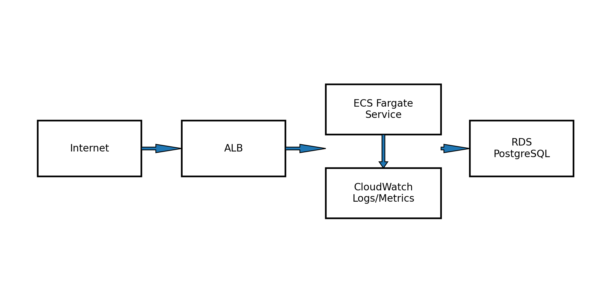

# Architecture Design

## Goals
- Highly-available application tier across 2 AZs
- Private compute (ECS tasks in private subnets)
- Public entry via ALB
- Managed database with encryption and backups
- Centralized logs to CloudWatch
- Repeatable provisioning with Terraform

## Network Design
- VPC CIDR: 10.20.0.0/16
- Public subnets: ALB + NAT gateway
- Private subnets: ECS tasks + RDS
- Outbound internet for tasks via NAT
- Inbound to tasks only from ALB SG

## Security
- Principle of least privilege task role
- RDS in private subnets, not publicly accessible
- SG restricts DB ingress to app SG only
- Encryption at rest via KMS for RDS
- State encryption for Terraform backend

## Diagram

