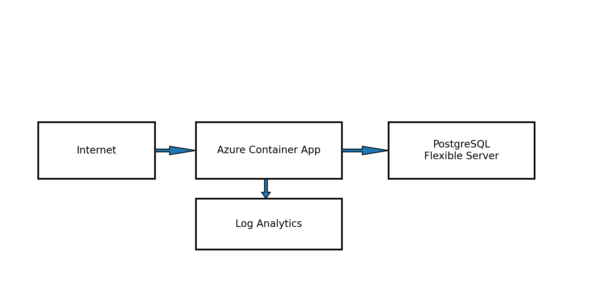

# Azure Architecture

## Components
- Azure Container Apps Environment + Container App
- Azure Container Registry (ACR)
- Azure Database for PostgreSQL Flexible Server
- Log Analytics Workspace for centralized logs
- Azure Monitor scheduled query alert for readiness anomalies

## Security Notes
- Container App secrets store DB password and ACR admin password (dev-friendly)
- For production: disable ACR admin, use managed identity, integrate Key Vault, and use private networking for Postgres.

## Diagram

