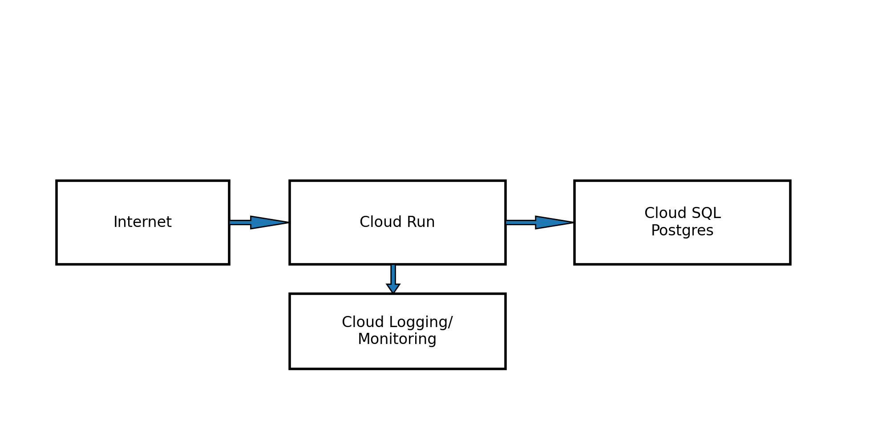

# GCP Architecture

## Components
- Cloud Run service (public invoker for demo)
- Artifact Registry (Docker)
- Cloud SQL Postgres + db/user
- Secret Manager stores DB password
- Cloud Logging/Monitoring for centralized observability
- Alert policy for elevated 5xx responses

## Security Notes
- Cloud Run uses a dedicated service account
- Secret access granted via IAM role `roles/secretmanager.secretAccessor`
- For production: remove public invoker, use IAP or authenticated invokers, restrict Cloud SQL networking.

## Diagram

